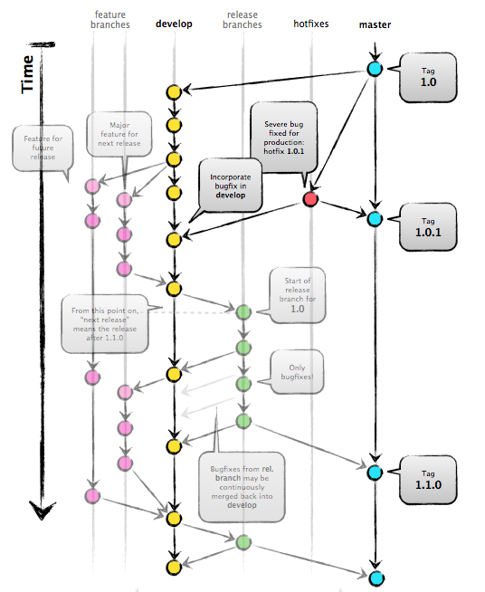
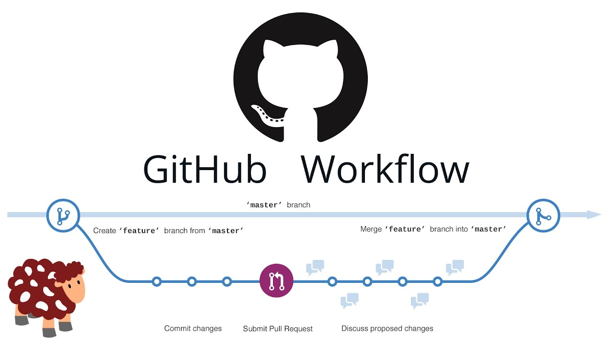
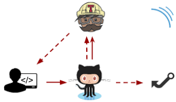
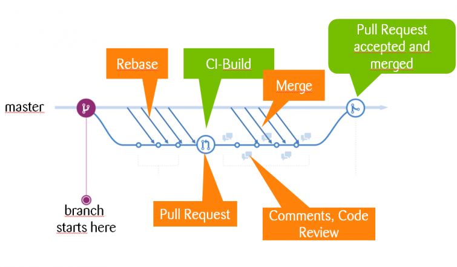
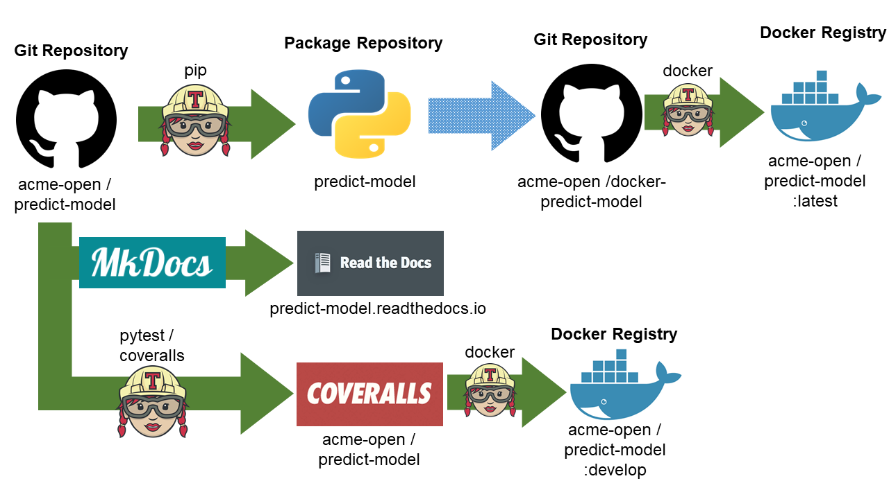

# 2 - DESENVOLVIMENTO

## Introdução

<p align="center"> </p>

1. [GNU Manifesto](https://www.gnu.org/gnu/manifesto.pt-br.html "GNU Manifesto")
2. [12 Factor App](https://12factor.net/pt_br/ "12 Factor App")
3. [Small Acts](http://smallactsmanifesto.org/ "12 Factor App")
4. [DataOps Manifesto](https://www.dataopsmanifesto.org/ "DataOps Manifesto")

<p align="center"> </p>

<p align="center"> [](https://www.youtube.com/watch?v=QGWvurS7ZP0) </p>

## Dica do dia

<p align="center">**NEVER BREAK THE RULES!**</p>
<p align="center"> </p>
<p align="center">**OR...**</p>
<p align="center"> </p>
<p align="center">**BUT...**</p>
<p align="center"> </p>

## GIT

<p align="center"> </p>
<p align="center">Linus Torvalds</p>
<p align="center">Recado do Linus: **FAÇAM UM CURSO DE GIT!**</p>

* https://www.pluralsight.com/courses/code-school-git-real
* https://www.udemy.com/git-na-pratica/
* https://www.youtube.com/watch?v=WVLhm1AMeYE&list=PLInBAd9OZCzzHBJjLFZzRl6DgUmOeG3H0

<p align="center"> </p>

## SSH

### CHAVE PÚBLICA / CHAVE PRIVADA
<p align="center"> </p>
<br>
<hr>
<br>

<p align="center"> </p>

* http://blakesmith.me/2010/02/08/understanding-public-key-private-key-concepts.html

### Configurar chaves

* https://gist.github.com/arthuralvim/9769d45a143e617db0316bd31e2772a6

## GIT & GITHUB

<p align="center"> </p>

### GIT Flow

* https://github.com/nvie/gitflow
* https://danielkummer.github.io/git-flow-cheatsheet/index.pt_BR.html

<p align="center"> </p>

### GITHUB Flow

<p align="center"> </p>

* PULL-REQUEST
* CODE REVIEW

### PEP8

<p align="center"> </p>

```bash
$ make pep8
```
<p align="center"> </p>

### CI

<p align="center"> </p>

* https://travis-ci.com
* https://travis-ci.org
* https://travis-ci.org/intelivix/sandbox-celery-rabbitmq

<p align="center"> </p>

<p align="center"> </p>

<p align="center"> </p>

<br>
<hr>
<br>

<p align="center"> </p>

<p align="center"> </p>

## TESTES

<p align="center"> </p>

- COBERTURA
    * https://nedbatchelder.com
    * https://github.com/nedbat
    * https://pytest-cov.readthedocs.io/
    * https://coverage.readthedocs.io/en/v4.5.x/

- COVERALLS
    * https://coveralls.io/
    * https://coveralls.io/github/intelivix/sandbox-celery-rabbitmq

<p align="center"> </p>

## ERROS

<p align="center"> </p>


<p align="center"> </p>

<p align="center"> []("SENTRY to the rescue!")</p>

<p align="center"> </p>

## TAREFAS EM LOTE

<p align="center"> </p>
<p align="center"> </p>


* https://github.com/apache/airflow
* https://airflow.apache.org/
* https://medium.com/data-hackers/primeiros-passos-com-o-apache-airflow-etl-f%C3%A1cil-robusto-e-de-baixo-custo-f80db989edae
* https://towardsdatascience.com/getting-started-with-apache-airflow-df1aa77d7b1b


<p align="center"> </p>
<p align="center"> </p>

* https://github.com/spotify/luigi
* https://labs.getninjas.com.br/usando-luigi-para-lidar-com-pipelines-de-tarefas-em-lote-batch-jobs-34544ab6cf16
* https://towardsdatascience.com/data-pipelines-luigi-airflow-everything-you-need-to-know-18dc741449b7
* https://luigi.readthedocs.io/en/stable/index.html

<p align="center"> </p>

## TAREFAS EM BACKGROUND

- SCREEN
    * https://gist.github.com/arthuralvim/22a2553ba18e014ed07d9cc067f36569

<p align="center"> </p>


## DOCKER

<p align="center"> </p>

https://pypi.org/project/python-dev-docker-project/

<p align="center"> </p>


## EXEMPLO DE FLUXO COMPLETO

<p align="center"> </p>


## PRÁTICA

<p align="center"> </p>

* Criar .travis.yml .
* Criar testes .
* Pull Request em mila-chatbot.

<p align="center"> </p>


